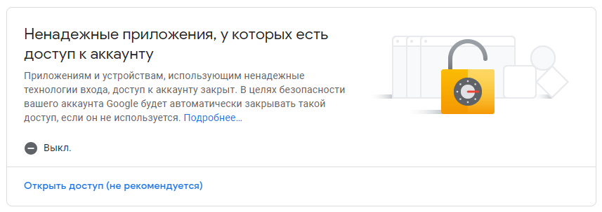
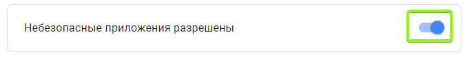

### Отправка и чтение EMAIL через GMAIL с использованием python

#### Инструкция запуска:
1. Убедитесь, что в настройках почты у вас включаны ненадежные приложения.
__[Аккаунт->Безопасность->Ненадежные приложения, у которых есть доступ к аккаунту]__

2. Для отправки писем запустите __python main.py mailfrom@gmail.com mailto@mail.ru "String to list test"__
заменив почту и сообщения на Ваши. Так же перед запуском незабудьте поменять login & password в send_email.py

3. Для получения всех непрочитанных писем просто запустите read_email.py. Перед запуском незабудьте поменять login & password.